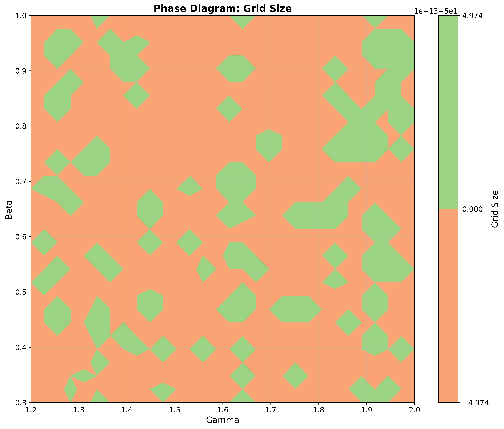

# Entropy Compensator: The Mathematics of Existence
# (原名: 递弱代偿理论验证系统)

[](https://opensource.org/licenses/MIT)
[](https://www.python.org/downloads/)
[](https://reactjs.org/)
[]()

> **"The degree of existence of all things declines over time; complexity is merely a compensatory measure to resist this decline."** — Wang Dongyue
>
> ("万物存在度的递减，是宇宙演化的根本方向；而代偿度的增加，只是为了对抗这种递减的权宜之计。" —— 王东岳)

## 🌌 Project Background (项目背景)

This project is a computational verification of the philosophical theory **"The Theory of Progressive Compensation" (递弱代偿)** proposed by Chinese philosopher Wang Dongyue.

### The Philosophical Core (理论核心)
Wang argues that the evolution of the universe (from atoms to cells, to organisms, to human society) is not a process of "progress" in the traditional sense, but a process of **degeneration in existence**.
*   **Weakening Existence ($P \downarrow$)**: As entities evolve, they become more dependent on external conditions and less stable. An atom is stable for billions of years; a human civilization can collapse in centuries.
*   **Compensatory Complexity ($C \uparrow$)**: To survive this weakening, entities must develop complex structures (attributes, capabilities, technologies) to compensate for their lack of intrinsic stability.

### The Mathematical Mapping (建模映射)
We translate this philosophy into a **Cellular Automata** model:

| Philosophy Concept | Simulation Variable | Mathematical Definition |
| :--- | :--- | :--- |
| **Existence Degree ($P$)** | **Survival Probability** | $P = r^n$ (System Reliability, where $n$ is complexity) |
| **Compensation Degree ($C$)** | **Complexity Level** | $C = n$ (Number of components/attributes) |
| **Maintenance Cost** | **Energy Consumption** | $Cost \propto C^\gamma$ (Super-linear metabolic cost) |
| **Evolution** | **Mutation & Selection** | Agents mutate $C$ to gain resources but pay reliability costs |

---

## 📸 Interactive Dashboard (可视化看板)

We built a modern, interactive lab interface powered by React & Ant Design.

### 1. Evolution Monitor (实时演化监控)

*Real-time tracking of the Inverse Correlation between Existence ($P$) and Complexity ($C$).*

### 2. Phase Transition Map (相变图谱)

*Identifying the "Edge of Chaos" where systems collapse under the weight of their own complexity.*

---

## 🧬 Key Findings (核心发现)

1.  **The Iron Law of Decay (递弱铁律)**
    *   Simulations consistently show that as agents evolve to be more complex (higher $C$) to acquire resources, their system reliability ($P$) inevitably decreases.
    *   **Equation Verified**: $P \times C \approx k$ (Conservation of Existence).

2.  **The Singularity Illusion (技术奇点的幻象)**
    *   We simulated a **"Neuralink Mode"** where agents can spend energy to "refactor" their code (reduce $C$ while keeping function).
    *   **Result**: It failed. The energy cost of refactoring accelerates resource depletion. Technology is just another form of compensation that demands higher entropy production.

3.  **Antifragility in Chaos (火星模式的反脆弱性)**
    *   In extreme environments ("Mars Mode" with exponential volatility), simple systems survival longer than complex ones.
    *   *Musk's Philosophy Verified: "The best part is no part."*

---

## 🚀 Quick Start

### 1. Clone
```bash
git clone https://github.com/metart766-ui/i-ruo-dai-chang.git
cd i-ruo-dai-chang
```

### 2. Run Simulation (Python)
```bash
python3 -m venv venv
source venv/bin/activate
pip install -r requirements.txt

# Start the simulation engine
python3 server.py
```

### 3. Launch UI (React)
```bash
cd wandongyu-viz
npm install
npm run dev
```
Open `http://localhost:5173` to explore the universe of decline.

---

## 📂 Architecture

*   `siyan_experiment.py`: Core evolution engine (Cellular Automata).
*   `mars_mode_stress_test.py`: Extreme environment stress testing.
*   `singularity_evolution.py`: AI/Refactoring mechanism simulation.
*   `wandongyu-viz/`: Frontend dashboard (React + AntV).

---

## 🤝 Contributing

We welcome philosophers, mathematicians, and coders!
Whether you want to challenge the theory or optimize the simulation, PRs are welcome.

## 📜 License

MIT License
